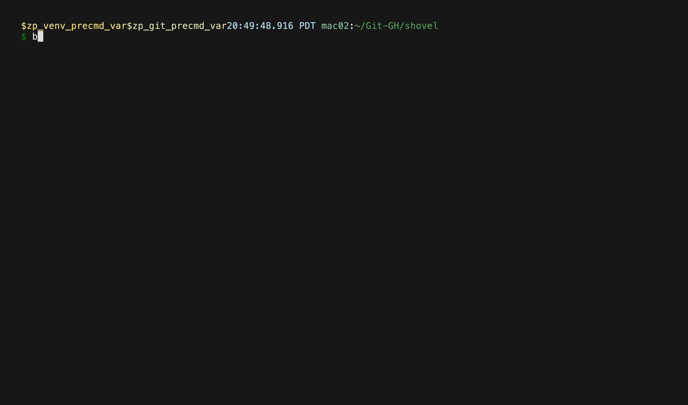

# shovel

An example go CLI to demo and learn new Go tooling!

## Use



```bash
shovel hello
```

## Install

- [Homebrew](https://brew.sh/): `brew install bbkane/tap/shovel`
- [Scoop](https://scoop.sh/):

```
scoop bucket add bbkane https://github.com/bbkane/scoop-bucket
scoop install bbkane/shovel
```

- Download Mac/Linux/Windows executable: [GitHub releases](https://github.com/bbkane/shovel/releases)
- Go: `go install go.bbkane.com/shovel@latest`
- Build with [goreleaser](https://goreleaser.com/) after cloning: `goreleaser --snapshot --skip-publish --clean`

## Notes

See [Go Developer Tooling](https://www.bbkane.com/blog/go-developer-tooling/) for notes on development tooling.